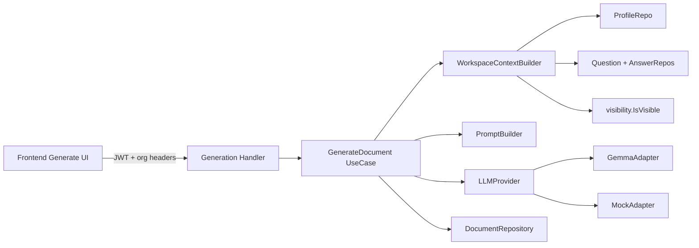

# Phase 3 — LLM + Markdown Belge Üretimi

**Durum:** Done  
**Tamamlanan slice’lar:** S1–S7  
**Branch önerisi:** `feature/ai-config-studio-phase3` (veya mevcut `main` üzerinde slice’lar)  
**Bağımlılık:** Phase 2 tamamlandı (`ad14240`)

---

## 1. Hedef özeti

Workspace bağlamından (profil + görünür anket cevapları) provider bağımsız LLM ile platform bağımsız Markdown belge üretmek; saklamak; listelemek; görüntülemek; yeniden üretmek.

| # | Hedef | Slice |
|---|--------|-------|
| 1 | Provider bağımsız LLM mimarisi | S1 |
| 2 | İlk provider: Gemma | S3 |
| 3 | Workspace context builder | S2 |
| 4 | Prompt builder | S2 |
| 5 | Markdown belge üretimi | S3–S4 |
| 6 | Belgelerin saklanması | S4 |
| 7 | Listeleme + görüntüleme | S4–S6 |
| 8 | Yeniden üretme | S5 |
| 9 | Health check | S3 |
| 10 | Retry, timeout, hata yönetimi | S3 |
| 11 | Mock provider + test | S1, S3 |
| 12 | Frontend üretim ekranları | S6 |

---

## 2. Mimari kurallar (sabit)

1. Business logic Gemma’ya bağlanmaz → yalnızca `LLMProvider`.
2. Gemma / Mock / (ileride Ollama, OpenAI-compatible) aynı interface altında.
3. Horizontal katmanlar korunur: `domain → application → infrastructure → http`.
4. **Yeni Workspace domain’i yok** — mevcut Tenant `Workspace` + RBAC.
5. Nihai LLM context **yalnızca backend**’de birleşir; FE cevap/profil birleştirmez.
6. Phase 2 visibility: gizli veya `active=false` sorular context’e **girmez**.
7. Secret, token, API key prompt’a ve log’a **yazılmaz**.
8. Ham prompt/output varsayılan olarak kalıcı saklanmaz (`architecture-decisions.md`); saklanan ürün Markdown belgedir (+ metadata).



---

## 3. Paket yerleşimi

```
backend/internal/
  domain/llm/
    provider.go          # LLMProvider, GenerateRequest, GenerateResponse, ProviderHealth
  domain/document/
    model/document.go    # GeneratedDocument
    repository/document_repository.go
  application/generation/
    dto/
    usecase/
      workspace_context_builder.go
      prompt_builder.go
      generate_document.go
      list_documents.go
      get_document.go
      regenerate_document.go
      provider_health.go
  infrastructure/llm/
    registry.go          # factory: name → provider
    gemma/client.go
    mock/provider.go
  infrastructure/postgres/document/
  infrastructure/http/handler/generation/   # veya document/
```

Frontend:

```
frontend/src/
  lib/api/documents.ts
  features/generate/
    generate-page.tsx
    document-list.tsx
    document-viewer.tsx
  app/(app)/o/[orgId]/w/[workspaceId]/generate/
    page.tsx                    # liste + üret CTA
    [documentId]/page.tsx       # detay / yeniden üret
```

---

## 4. Domain modelleri

### 4.1 `LLMProvider` (port)

```go
type GenerateRequest struct {
    SystemPrompt string
    UserPrompt   string
    // Model/temperature optional overrides — provider default kullanabilir
    MaxTokens    int
}

type GenerateResponse struct {
    Content      string            // Markdown body
    Provider     string
    Model        string
    FinishReason string
    Usage        TokenUsage        // optional; log’a dikkatli
}

type ProviderHealth struct {
    Provider string
    Healthy  bool
    Message  string
}

type LLMProvider interface {
    Name() string
    Generate(ctx context.Context, req GenerateRequest) (GenerateResponse, error)
    Health(ctx context.Context) (ProviderHealth, error)
}
```

### 4.2 `GeneratedDocument`

| Alan | Tip | Not |
|------|-----|-----|
| `id` | UUID | PK |
| `organization_id` | UUID | org scope |
| `workspace_id` | UUID | workspace scope |
| `title` | text | örn. “AI Development Configuration” |
| `document_type` | text | Phase 3: `studio_markdown` (ileride çeşitlenebilir) |
| `language` | text | `tr` \| `en` — üretim anındaki workspace tercihi |
| `status` | text | `pending` \| `succeeded` \| `failed` |
| `markdown_body` | text | ürün çıktısı |
| `provider_name` | text | `gemma`, `mock`, … |
| `model_name` | text | opsiyonel |
| `error_message` | text | failed ise kullanıcıya güvenli mesaj |
| `source_fingerprint` | text | opsiyonel hash (profil+görünür cevaplar); regenerate karşılaştırması |
| `created_by` | UUID | user id |
| `created_at` / `updated_at` | timestamptz | |

**Saklanmaz (Phase 3):** raw system/user prompt, API key, full token stream.

**Regenerate:** yeni satır oluşturur (versiyon geçmişi basit append-only). İleride “supersedes” FK eklenebilir; Phase 3’te zorunlu değil.

---

## 5. Migration şeması

**Dosya:** `00016_generated_documents.sql`

```sql
-- +goose Up
CREATE TABLE IF NOT EXISTS generated_documents (
    id                 UUID PRIMARY KEY,
    organization_id    UUID NOT NULL REFERENCES organizations(id),
    workspace_id       UUID NOT NULL REFERENCES workspaces(id),
    title              TEXT NOT NULL,
    document_type      TEXT NOT NULL DEFAULT 'studio_markdown',
    language           TEXT NOT NULL CHECK (language IN ('tr', 'en')),
    status             TEXT NOT NULL CHECK (status IN ('pending', 'succeeded', 'failed')),
    markdown_body      TEXT NOT NULL DEFAULT '',
    provider_name      TEXT NOT NULL DEFAULT '',
    model_name         TEXT NOT NULL DEFAULT '',
    error_message      TEXT NOT NULL DEFAULT '',
    source_fingerprint TEXT NOT NULL DEFAULT '',
    created_by         UUID REFERENCES users(id),
    created_at         TIMESTAMPTZ NOT NULL DEFAULT NOW(),
    updated_at         TIMESTAMPTZ NOT NULL DEFAULT NOW()
);

CREATE INDEX idx_generated_documents_workspace_created
    ON generated_documents (workspace_id, created_at DESC);

CREATE INDEX idx_generated_documents_org
    ON generated_documents (organization_id);

-- +goose Down
DROP TABLE IF EXISTS generated_documents;
```

Not: Sync üretimde `pending` kısa ömürlü olabilir; yine de status kolonu async’e geçişi kolaylaştırır.

---

## 6. Endpoint sözleşmesi

Tüm workspace route’ları: JWT + `X-Organization-ID` + workspace org ownership (Phase 2 ile aynı).

### 6.1 Üret

```
POST /api/v1/workspaces/{workspaceId}/documents/generate
Permission: generation:run
```

Request body (opsiyonel):

```json
{
  "title": "AI Development Configuration",
  "language": "tr"
}
```

- `language` yoksa workspace `preferred_document_language`.
- Context her zaman backend’de kurulur; body’de profile/answers **kabul edilmez**.

Response `201`:

```json
{
  "id": "...",
  "workspace_id": "...",
  "title": "...",
  "document_type": "studio_markdown",
  "language": "tr",
  "status": "succeeded",
  "markdown_body": "# ...",
  "provider_name": "gemma",
  "model_name": "...",
  "created_at": "...",
  "updated_at": "..."
}
```

Hatalar:

| Durum | Kod | Örnek |
|-------|-----|--------|
| Auth yok / invalid JWT | 401 | |
| Org izni yok / foreign workspace | 403 | |
| Context yetersiz (policy) | 422 | zorunel görünür sorular eksik — product kararı Slice S2’de sabitlenir |
| Provider timeout / upstream | 502 veya 503 | güvenli mesaj |
| Provider disabled / mock-only misconfig | 503 | |

### 6.2 Listele

```
GET /api/v1/workspaces/{workspaceId}/documents
Permission: document:read
```

Query: `?limit=20` (page opsiyonel, Phase 2 pagination helper).

Response `200`:

```json
{
  "documents": [
    {
      "id": "...",
      "title": "...",
      "language": "tr",
      "status": "succeeded",
      "provider_name": "gemma",
      "created_at": "...",
      "updated_at": "..."
    }
  ]
}
```

Liste cevabında `markdown_body` **olmaz** (payload şişmesin).

### 6.3 Görüntüle

```
GET /api/v1/workspaces/{workspaceId}/documents/{documentId}
Permission: document:read
```

Response: tam `GeneratedDocument` DTO (`markdown_body` dahil). Foreign workspace → 403; yok → 404.

### 6.4 Yeniden üret

```
POST /api/v1/workspaces/{workspaceId}/documents/{documentId}/regenerate
Permission: generation:run
```

- Mevcut belgeyi okur (metadata); **güncel** context ile yeni generate çalıştırır.
- Yeni document kaydı döner (`201`). Eski kayıt kalır.

### 6.5 Health

```
GET /api/v1/llm/health
Permission: generation:read
```

Alternatif (workspace’e bağlamak istenirse):  
`GET /api/v1/workspaces/{workspaceId}/generation/health` — aynı permission.

Response `200`:

```json
{
  "provider": "gemma",
  "healthy": true,
  "message": "ok"
}
```

Unhealthy → HTTP 200 + `healthy: false` **veya** 503 — tercih: **200 + healthy flag** (UI soft-warn); generate sırasında hard-fail.

---

## 7. Context & prompt

### 7.1 `WorkspaceContextBuilder`

Girdiler (repo / mevcut use-case paylaşımları):

1. Workspace (`preferred_document_language`, name, slug)
2. Project profile (varsa; yoksa boş bölümler)
3. Default questionnaire set + active questions + answers
4. `visibility.BuildAnswerLookup` + `IsVisibleQuestion`
5. Filtre: `q.Active && visible`

Çıktı (internal struct, HTTP’ye açılmaz):

```go
type WorkspaceLLMContext struct {
    WorkspaceName string
    Language      string // tr|en
    Profile       ProfileSnapshot
    Answers       []VisibleAnswer // key, title, category, value
    GeneratedAt   time.Time
}
```

### 7.2 `PromptBuilder`

- System: rol + Markdown-only çıktı kuralları + dil
- User: yapılandırılmış context (kategorilere göre)
- Gizli/inactive sorular yok
- Hassas alan yok (token/secret placeholder’ları strip)

### 7.3 Gate politikası (ürün kararı — öneri)

Phase 3 MVP:

- **Soft gate:** generate her zaman çalışır; eksik zorunlu görünür sorular prompt’a “Eksik: …” olarak işlenebilir veya Completeness/Missing özeti eklenir.
- **Hard gate (opsiyonel flag):** `REQUIRE_COMPLETE_CONTEXT=true` → 422.

Öneri: MVP soft gate; FE’de missing-info uyarısı göster.

---

## 8. Config

`internal/shared/config/config.go` içine:

| Env | Default | Açıklama |
|-----|---------|----------|
| `LLM_PROVIDER` | `mock` (dev) / `gemma` (prod dokümantasyonu) | registry key |
| `LLM_BASE_URL` | — | Gemma/OpenAI-compatible base |
| `LLM_API_KEY` | — | header; loglanmaz |
| `LLM_MODEL` | provider default | |
| `LLM_TIMEOUT_SECONDS` | `60` | context deadline |
| `LLM_MAX_RETRIES` | `2` | transient errors |
| `LLM_ENABLED` | `true` | false → health unhealthy, generate 503 |

Server: generate path için write timeout ≥ `LLM_TIMEOUT_SECONDS` (+ buffer). Dokümante et: `SERVER_WRITE_TIMEOUT_SECONDS=90`.

Production guard (Phase 2 stili): `APP_ENV=production` ve `LLM_PROVIDER=gemma` iken `LLM_BASE_URL` / key eksikse startup warn veya fail — ürün kararı S3’te.

---

## 9. Hata, retry, timeout

| Katman | Davranış |
|--------|----------|
| `context.WithTimeout` | Generate use-case provider çağrısı |
| Retry | Yalnızca transient (timeout, 429, 502/503); 4xx retry yok |
| Mapping | Provider error → `DomainError` (BadGateway / ServiceUnavailable / Validation) |
| Log | `provider`, `model`, `workspace_id`, `duration`; **prompt/body/key yok** |
| FE | `getErrorMessage` + toast; failed document `error_message` güvenli metin |

---

## 10. RBAC

Seed’de zaten var — yeni permission gerekmez:

| Aksiyon | Permission |
|---------|------------|
| Generate / regenerate | `generation:run` |
| Health | `generation:read` |
| List / get | `document:read` |

`document:write` / `document:approve`: Phase 3’te kullanılmayabilir (approve Phase 4+); generate use-case `generation:run` yeterli.

---

## 11. Test stratejisi

| Katman | Ne |
|--------|-----|
| Unit | Context builder (visibility filter), prompt builder (no secrets), mock provider |
| Unit | Generate use-case mock LLM + mock repos |
| Integration HTTP | 401/403; generate→list→get; foreign workspace 403; regenerate yeni id |
| Mock default | CI’de dış ağ yok; `LLM_PROVIDER=mock` |

Mock davranışı: deterministik Markdown (`# Studio Document\n\n...`) + context’ten workspace adını göm.

---

## 12. Frontend sözleşmesi

1. `lib/api/documents.ts` — generate, list, get, regenerate, health  
2. `features/generate/generate-page.tsx` — health badge, “Belge üret”, liste  
3. `features/generate/document-viewer.tsx` — Markdown render + “Yeniden üret”  
4. Route: `generate/page.tsx` + `generate/[documentId]/page.tsx`  
5. Bağımlılık: `react-markdown` (+ gerekirse `remark-gfm`)  
6. i18n `tr.ts` → `generate.*` (title, empty, loading, error, regenerate, healthOk/Fail, create)  
7. Pattern: Plan/Questionnaire — React Query, Skeleton, EmptyState, toast  

FE **göndermez:** profile JSON, answers array, birleşik prompt.

---

## 13. Slice sırası (uygulama)

### S1 — LLM port + Mock *(yarım gün)*

- `domain/llm` interface + types  
- `infrastructure/llm/mock`  
- `registry` / factory  
- Unit test: mock Generate + Health  
- **Kapı:** `go test` yeşil; henüz HTTP yok  

### S2 — Context + Prompt *(1 gün)*

- `WorkspaceContextBuilder` (visibility + active filter)  
- `PromptBuilder` (tr/en)  
- Unit testler: uses_ai=false → AI alt sorular context’te yok  
- **Kapı:** builder testleri  

### S3 — Gemma adapter + resilience *(1–1.5 gün)*

- Config `LLM*`  
- Gemma HTTP client (OpenAI-compatible veya ürünün gerçek Gemma API’si — impl notunda netleştir)  
- Timeout + retry  
- `GET /api/v1/llm/health`  
- **Kapı:** mock ile health/generate unit; Gemma live smoke opsiyonel (env ile)  

### S4 — Document persist + generate/list/get API *(1.5 gün)* ✅

- Migration `00016`  
- Document repo + generate/list/get use-cases  
- Router + RBAC (`generation:run`, `document:read`)  
- Unit tests (mock LLM + repos): success, 503 disabled, 502 provider fail, list summary, foreign doc 403  
- **Kapı:** `go test ./...` yeşil; live E2E smoke S7’de (migration 16 + mock generate)  

### S5 — Regenerate *(yarım gün)* ✅

- `POST .../documents/{documentId}/regenerate` + use-case  
- Test: yeni id, eski kayıt duruyor; kaynak 404  

### S6 — Frontend *(1–1.5 gün)* ✅

- `lib/api/documents.ts` + `features/generate/*` + routes  
- `react-markdown` + `remark-gfm`; `tr.generate.*`  
- lint/build yeşil  
- Manuel smoke: üret → liste → aç → yeniden üret (S7)  

### S7 — Dokümantasyon + doğrulama *(yarım gün)* ✅

- `backend/STUDIO.md` Phase 3 bölümü  
- `docs/architecture-decisions.md` Phase 3 → Done  
- `go test ./...` yeşil; `npm run lint/build` yeşil  
- API smoke: `node backend/scripts/smoke_phase3_documents.mjs` → **10 PASS / 0 FAIL**  
- Migration 16 uygulandı (local goose)

**Toplam kabaca:** 5–7 iş günü.

---

## 14. Smoke checklist (Phase 3 bitiş)

| # | Kontrol | Sonuç |
|---|---------|--------|
| 1 | Migration 16 uygulandı | ✅ goose → v16 |
| 2 | `LLM_PROVIDER=mock` generate → 201 + markdown | ✅ smoke |
| 3 | Listede görünür; get body dolu | ✅ smoke |
| 4 | Regenerate → yeni id (eski kalır) | ✅ smoke |
| 5 | Foreign org document → 403 | ✅ smoke |
| 6 | uses_ai=false → AI alt sorular context’te yok | ✅ unit (`WorkspaceContextBuilder` test) |
| 7 | Health mock → healthy | ✅ smoke |
| 8 | FE Üret ekranı TR + markdown viewer | ✅ routes/build + `tr.generate.*` |
| 9 | Logda API key / full prompt yok | ✅ design + generate log metadata-only |
| 11 | Failed generate → `failed` row + fingerprint UI | ✅ closing audit follow-up |
| 10 | Commit mesajı önerisi | `feat: add Phase 3 LLM document generation` |

Yeniden çalıştırma: API ayaktayken `node backend/scripts/smoke_phase3_documents.mjs`

---

## 15. Bilinçli ertelemeler (Phase 3 dışı)

- Streaming SSE  
- Document approve workflow  
- Ham prompt/output audit store  
- Ollama / OpenAI-compatible ikinci provider (interface hazır; impl sonra)  
- Async job queue / Kafka generation events  
- Export (PDF/ZIP)  
- Scoring / Observe (Phase 4)

---

## 16. İlk uygulama adımı

Onay sonrası sıra:

1. Branch aç  
2. **S1** interface + mock + test  
3. **S2** context/prompt  
4. … slice sırasıyla devam  

Bu plan onaylanmadan kod yazılmamalıdır; onay sonrası S1 ile başlanır.
